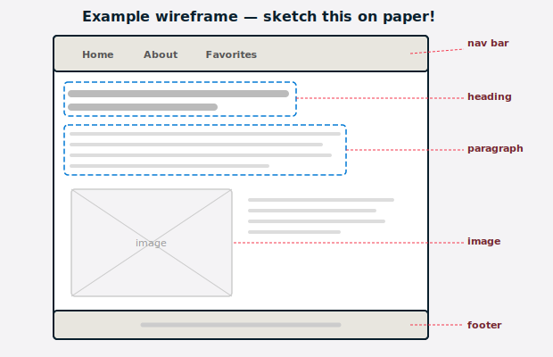
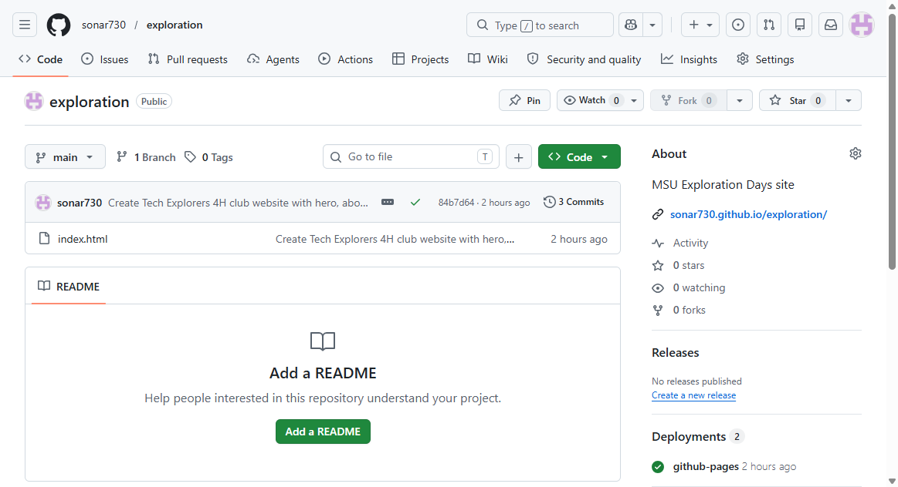
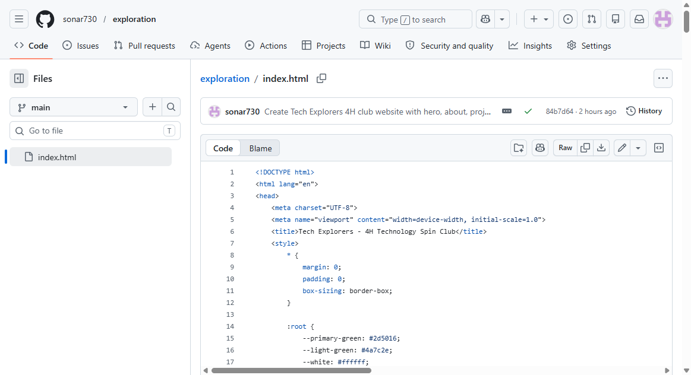
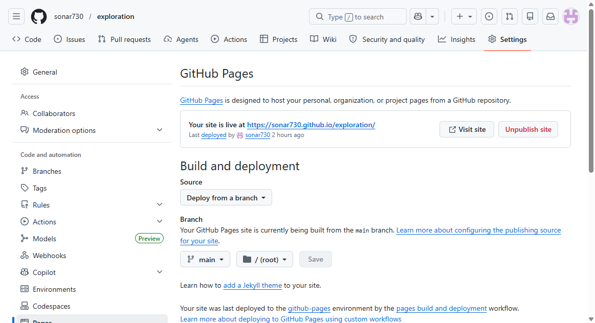
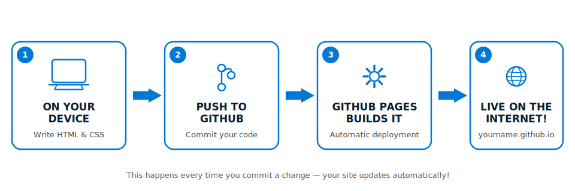
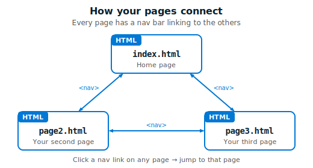
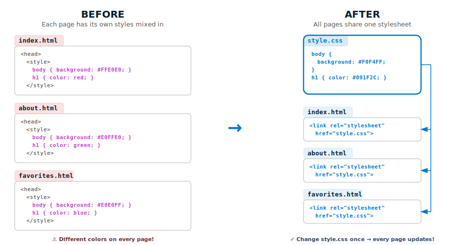
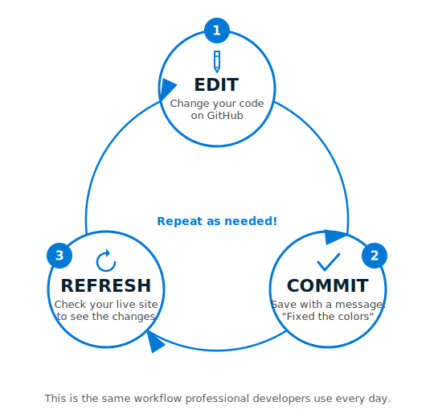

# Using GitHub & AI to Create & Host Websites — Student Activity Guide (Laptop)

Welcome! Today you'll design a website on paper, learn about source control, create a GitHub account, and use AI assistants — like **GitHub Copilot** and **Microsoft Copilot** — to build and publish your very own website — live on the internet. No experience needed — just curiosity!

## Jump to a section

| | Section | Time |
|---|---|---|
| 📖 | [Glossary — Key Terms](#glossary--key-terms) | Reference |
| ✍️ | [Activity 1: Wireframe Your Website](#activity-1-wireframe-your-website-20-minutes) | 20 min |
| 🔑 | [Activity 2: GitHub Account & First Repo](#activity-2-create-a-github-account--first-repository-25-minutes) | 25 min |
| 🌐 | [Activity 3: Go Live with GitHub Pages](#activity-3-go-live-with-github-pages-10-minutes) | 10 min |
| 🤖 | [Activity 4: Use AI to Build Your Website](#activity-4-use-ai-to-build-your-website-40-minutes) | 40 min |
| 🌟 | [Bonus: Keep Going After Today](#bonus-keep-going-after-today) | Take home |
| 🔄 | [Quick Reference: Edit → Commit → Refresh](#quick-reference-the-edit--commit--refresh-cycle) | Cheat sheet |

---

## Glossary — Key Terms

Keep this page handy. These terms come up throughout the session.

| Term | What it means |
|---|---|
| **HTML** | HyperText Markup Language — the code that defines the content and structure of a web page (headings, paragraphs, images). Think of it as the skeleton of a website. |
| **CSS** | Cascading Style Sheets — the code that controls how a web page looks (colors, fonts, spacing, layout). Think of it as the clothes and makeup. |
| **Repository (repo)** | A project folder on GitHub that holds all your files and tracks every change you make. |
| **Commit** | A saved snapshot of your changes, with a short message describing what you changed. Like pressing "save" with a sticky note attached. |
| **GitHub Pages** | A free GitHub feature that turns your repo's files into a live website anyone can visit. |
| **Source control** | The practice of tracking and managing changes to code. GitHub is a source control platform. |
| **AI (Artificial Intelligence)** | Software that can understand your instructions and generate content — like code, text, or images. Today you'll use it to write HTML and CSS. |
| **GitHub Copilot** | An AI coding assistant built into GitHub. You get free access with your GitHub account. Any AI assistant works for today's activities — use whichever one you like. |
| **Prompt** | The instruction or question you type into an AI assistant. Better prompts = better results. |
| **Wireframe** | A rough sketch of a web page layout — like a blueprint for your site, drawn on paper before you write any code. |
| **Accessibility** | Designing your website so everyone can use it — including people who use screen readers, can't see certain colors, or navigate without a mouse. When you make a site accessible, it actually works better for everyone. |
| **WCAG** | Web Content Accessibility Guidelines — an international set of rules for making websites accessible. Professional developers follow WCAG to make sure their sites work for all users. |
| **Alt text** | A short text description of an image that screen readers read aloud. Also shows up if the image fails to load. |
| **Color contrast** | How much text stands out from its background color. High contrast (like dark text on a light background) makes text easy to read for everyone — especially in bright sunlight or for people with low vision. |

---

## Activity 1: Wireframe Your Website (20 minutes)

### Your Goal

Design your website on paper before you write any code. Real web designers always start with a sketch!

### Step 1: Pick your website idea

What do YOU want to make a website about? Here are some ideas to get you started — or come up with your own:

| Idea | What it could include |
|---|---|
| **Fan page** | Your favorite game, artist, show, or team — images, facts, links, rankings |
| **About me** | Your interests, hobbies, playlists, favorite things, a photo |
| **Club or group page** | Your 4-H club, sports team, friend group — meetings, projects, members |
| **Hobby showcase** | Art, photography, recipes, skateboard tricks, fashion, music you make |
| **Top 10 / rankings** | Best albums, games, movies, snacks, places — with your commentary |
| **Tips & guides** | How to get better at something you know well |
| **Creative writing** | Your poems, stories, or lyrics — styled to look amazing |
| **Fictional page** | A website for a made-up band, restaurant, superhero, or business |

**Pro tip:** Pick something you could talk about for 10 minutes without getting bored. That's your website topic.

> **Stuck on ideas?** Try asking an AI assistant for help! Open [copilot.microsoft.com](https://copilot.microsoft.com) (no account needed) and type: *"I'm a teenager and I want to make a fun website. Give me 10 creative ideas."* AI is great for brainstorming — not just for writing code.

### Step 2: Plan your pages

Real websites have more than one page — a homepage, an about page, a gallery, a contact page, etc. Decide what pages YOUR site will have.

- **Homepage** (`index.html`) — every website has one. This is the first page visitors see.
- **Page 2**: _____________ (`_________.html`) — e.g., About, Favorites, Gallery, Projects
- **Page 3** (optional): _____________ (`_________.html`)

You'll build the homepage first, then add more pages later.

### Step 3: Draw your wireframe

Use the **Paper Wireframe Template** your instructor provided, or draw your own on blank paper. **Wireframe your homepage** — the other pages can be quick notes on the back.

Your wireframe should include:

- [ ] **A page title or site name** — What's your website called?
- [ ] **A navigation bar** — Links to your pages (e.g., Home | About | Favorites)
- [ ] **At least 2–3 sections of content** on the homepage (intro, highlights, links — whatever fits your idea)
- [ ] **A color scheme** — Pick 2–3 colors. Write them on your wireframe or color them in.
- [ ] **A layout** — Where does each element go? Try one of these:
  - **Stacked sections:** Content flows top-to-bottom with clear headings
  - **Card style:** Content in separate boxes/cards with borders or shadows
  - **Hero + content:** A big eye-catching header image/title at the top, then content below
- [ ] **Your name** — Somewhere on the page (header, footer, or sidebar) — it's YOUR website!
- [ ] **On the back:** A quick list of what goes on each of your other pages

### Example wireframe

```
┌──────────────────────────────────┐
│  � Tech Explorers SPIN Club     │  ← Title
│──────────────────────────────────│
│  [club banner / logo area]       │
│                                  │
│  About Our Club                  │  ← Section 1
│  We meet every Thursday to       │
│  learn coding, robotics, and     │
│  how tech shapes our world.      │
│                                  │
│  Our Projects                    │  ← Section 2
│  • Building websites             │
│  • Raspberry Pi experiments      │
│  • 3D printing                   │
│                                  │
│  Upcoming Meetings               │  ← Section 3
│  June 15 — Intro to Robotics     │
│  June 22 — 3D Design Workshop    │
│──────────────────────────────────│
│  Made by Alex — 2026  🍀        │  ← Footer
└──────────────────────────────────┘

Colors: Green and white, dark text
```



### Tips

- There's no wrong answer — this is YOUR design.
- Use colored pencils to show your color scheme.
- Don't worry about making it perfect. Wireframes are rough sketches, not finished art.
- Keep your wireframe nearby — you'll use it as a reference when you ask the AI to build your page.

---

## Activity 2: Create a GitHub Account & First Repository (25 minutes)

### Part A: Create Your GitHub Account

1. Open a browser on your device.
2. Go to **github.com**.
3. Click **Sign up** (top right).
4. Enter your **email address**.
5. Create a **password** (make it strong — mix of letters, numbers, and symbols).
6. Choose a **username**.
   - This becomes part of your website URL: `https://YOUR-USERNAME.github.io/...`
   - Pick something you'd be happy sharing — keep it appropriate and memorable!
   - Examples: `alex-codes`, `music-fan-2026`, your first name + a number
7. Complete the **verification puzzle**.
8. Check your email for a **verification code** and enter it.
9. Skip the personalization survey (or fill it out — your choice).
10. You should now see your **GitHub dashboard**. You're in!

> **No email?** Ask your instructor for alternatives — you might use a school email, a parent's email, or share an account with a partner.

### Part B: Create Your First Repository

A repository (repo) is your project folder on GitHub. Let's make one!

1. Click the **+** icon in the top-right corner of GitHub.
2. Click **New repository**.
3. Fill in the details:

   | Field | What to enter |
   |---|---|
   | Repository name | `my-website` (or whatever fits your topic — this goes in your URL!) |
   | Description | `My personal website` (optional) |
   | Public / Private | Select **Public** (required for free GitHub Pages hosting) |
   | Add a README file | **Check this box** ✅ |

4. Click **Create repository**.

You should see your new repo with a `README.md` file in it. Nice!



### Part C: Create Your First HTML File

1. In your repo, click **Add file** → **Create new file**.
2. In the filename box at the top, type: `index.html`

   > **Important:** Type it exactly — all lowercase, no spaces. GitHub Pages looks for this exact filename.

3. In the big text area below, type this starter code:

   ```html
   <!DOCTYPE html>
   <html>
   <head>
       <title>My Website</title>
   </head>
   <body>
       <h1>Welcome to my site!</h1>
       <p>Coming soon...</p>
   </body>
   </html>
   ```

4. Scroll down to the **"Commit changes"** section.
5. In the commit message box, type: `Add my first HTML file`
6. Click **Commit changes**.

You just made your first commit! GitHub saved a snapshot of your file with your message attached.

> **What just happened?** You created a file, wrote some HTML (the language websites use), and committed it — which means GitHub saved it and recorded what you did. This is source control in action!



---

## Activity 3: Go Live with GitHub Pages (10 minutes)

### Your Goal

Turn on GitHub Pages so your placeholder website goes live on the internet — before AI changes anything!

### Enable GitHub Pages — Step by Step

1. Go to your repo on **github.com**.
2. Click **Settings** (the ⚙️ gear icon near the top of the repo page).
3. In the left sidebar, scroll down and click **Pages**.
4. Under **"Source"**, select **Deploy from a branch**.
5. Under **"Branch"**, select:
   - Branch: **main**
   - Folder: **/ (root)**
6. Click **Save**.
7. **Wait 1–2 minutes.** GitHub is building your site.
8. **Refresh the page.** A green banner appears with your live URL!
9. Click the URL to see your website. It looks like this:

   ```
   https://YOUR-USERNAME.github.io/my-website/
   ```



### Your website is LIVE!

It's simple right now — just "Welcome to my site! Coming soon..." — but it's on the internet. Anyone in the world could visit that URL. Keep this tab open — in the next activity, you'll use AI to completely transform it.

> **Seeing a 404 error?** Don't panic — GitHub Pages can take 2–3 minutes to set up. Wait, then refresh. If it still doesn't work after 5 minutes, check:
> - Is your file named exactly `index.html`? (not `Index.html` or `index.htm`)
> - Is `index.html` in the root of your repo? (not inside a folder)
> - In Settings → Pages, is the branch set to `main` and the folder set to `/ (root)`?

**Bookmark your URL or keep the tab open — you'll refresh it later to see the before and after!**



---

## Activity 4: Use AI to Build Your Website (40 minutes)

You're going to build ALL the pages of your website — using a different AI tool for each one. Then you'll use **GitHub Copilot** to pull everything together with one shared stylesheet. Your site is already live, so you'll see it transform in real time!

### AI Tools You Can Use (pick a different one for each page!)

**No account needed — just open and go:**

| AI Tool | URL |
|---|---|
| Microsoft Copilot | [copilot.microsoft.com](https://copilot.microsoft.com) |
| Meta AI | [meta.ai](https://meta.ai) |

**Free account required:**

| AI Tool | URL | Account |
|---|---|---|
| ChatGPT | [chatgpt.com](https://chatgpt.com) | Free tier |
| Google Gemini | [gemini.google.com](https://gemini.google.com) | Google account (you probably have one) |
| Perplexity | [perplexity.ai](https://www.perplexity.ai) | Free tier |
| Mistral Le Chat | [chat.mistral.ai](https://chat.mistral.ai) | Free account |
| HuggingChat | [huggingface.co/chat](https://huggingface.co/chat) | Free account |

**Save for Part B (CSS unification):**

| AI Tool | URL | Why save it? |
|---|---|---|
| GitHub Copilot | [github.com/copilot](https://github.com/copilot) | Uses your GitHub account. Free tier has limited messages — save them for the unification step! |

> **Why different tools?** Two reasons: (1) It spreads the load so you don't run out of free messages on any one tool. (2) The same prompt works everywhere — that's the point! You'll see that different AI tools make different styling choices, and that's actually what makes Part B so cool.

### The Base Prompt (use this for EVERY page)

This is your starting template. It ensures every page uses standard HTML structure — which matters a LOT when we unify the styling later.

> Write an HTML page called `[FILENAME]`. Use semantic HTML5 elements: `<header>`, `<nav>`, `<main>`, `<section>`, `<footer>`. Use a heading hierarchy: `<h1>` for the page title, `<h2>` for section headings, `<h3>` for sub-headings. Include a `<nav>` bar at the top with links to: [LIST ALL YOUR PAGES]. Put all CSS in a `<style>` tag in the `<head>` — do NOT use inline `style=""` attributes on individual elements. Include `alt` text on all images. Make it responsive for mobile screens.
>
> This page is about: [DESCRIBE THIS PAGE'S CONTENT]
> Style/colors: [YOUR PREFERENCES]

### Part A: Build Your Pages (25 min)

Build as many pages as you planned in your wireframe — aim for at least 3! Use a **different AI tool** for each one.

#### Page 1: Your Homepage (index.html)

1. Open your **first AI tool** (any tool from the list above — NOT GitHub Copilot yet).
2. Paste the base prompt and fill in the blanks. For example:

   > Write an HTML page called `index.html`. Use semantic HTML5 elements: `<header>`, `<nav>`, `<main>`, `<section>`, `<footer>`. Use a heading hierarchy: `<h1>` for the page title, `<h2>` for section headings, `<h3>` for sub-headings. Include a `<nav>` bar at the top with links to: Home (index.html), About (about.html), and Favorites (favorites.html). Put all CSS in a `<style>` tag in the `<head>` — do NOT use inline style attributes. Include alt text on all images. Make it responsive.
   >
   > This page is about: The homepage for my personal site called "Alex's World". Include a big welcome heading, a short intro paragraph about me, and a section with 3 cards showing my top interests.
   > Style/colors: Dark blue background, white text, neon blue accents. Modern and cool.

3. Review the code. Does it match your wireframe? If not, ask the AI to adjust.
4. Copy the code.
5. Go to your repo on **github.com** → click **`index.html`** → **pencil icon** → select all → delete → paste → commit.
6. **Refresh your live site** — watch the transformation!

> **Look at the colors!** Before you commit, look at the diff view GitHub shows you. Lines in **red** are being removed (old code). Lines in **green** are being added (your new code). This is source control showing you exactly what changed.

#### Page 2, 3, 4... (more pages!)

For each additional page, repeat the process with a **different AI tool**:

1. Open a **different AI tool** from the list.
2. Paste the **same base prompt** — just change the filename and content description.
3. Copy the code.
4. In your repo: **Add file** → **Create new file** → name it to match your nav link (e.g., `about.html`) → paste → commit.
5. Refresh your live site and click the nav link — the new page loads!



**Example prompts for additional pages:**

> Write an HTML page called `about.html`. [same base prompt rules]...
>
> This page is about: My "About Me" page. Include a heading, a paragraph about who I am, my favorite quote in a styled blockquote, and a list of my hobbies with emoji icons.
> Style/colors: Same dark blue and neon blue theme.

> Write an HTML page called `favorites.html`. [same base prompt rules]...
>
> This page is about: My "Top 10 Favorites" page. Show a ranked list of my top 10 favorite movies, each in a numbered card with the title and a one-line review.
> Style/colors: Same dark blue theme but with gold accent for the rankings.

> **Notice anything?** Your pages probably don't look exactly the same — different colors, fonts, or spacing. That's because different AI tools made different CSS choices. Don't worry — we're about to fix that!

### Part B: Unify with GitHub Copilot (10 min)

Time to make your site look professional. **GitHub Copilot** is going to pull all the CSS out of your pages and create one shared stylesheet.

1. Open **GitHub Copilot** at [github.com/copilot](https://github.com/copilot).
2. Paste this prompt (fill in your file list and colors):

   > I have a multi-page website in my GitHub repo with these HTML files: [LIST YOUR FILES, e.g., index.html, about.html, favorites.html]. Each page has its own `<style>` tag with CSS. I want you to:
   > 1. Create a single shared CSS file called `style.css` with all the styling.
   > 2. Give me updated versions of each HTML file with the `<style>` tag removed and replaced with `<link rel="stylesheet" href="style.css">` in the `<head>`.
   > 3. Make the styling consistent across ALL pages — same colors, fonts, spacing, nav bar style, and footer.
   > 4. Keep all the HTML content and structure the same — only change the styling.
   > Style/colors: [YOUR COLOR SCHEME AND VIBE]

3. Apply the changes to your repo:
   - **Create `style.css`**: In your repo, click **Add file** → **Create new file** → name it `style.css` → paste the CSS Copilot generated → commit.
   - **Update each HTML file**: Click the file → pencil icon → replace the content with Copilot's updated version → commit.
   - **Refresh your live site.**

4. Click through your pages — they all match now! Same colors, same fonts, same nav bar, same footer.

> **The power of `style.css`:** Try this — edit `style.css` and change one color. Commit. Refresh. Watch EVERY page change at once. That's why professional websites keep CSS in a separate file — change one file, update the whole site.

> **What just happened?** Before, each page had its own styling buried inside it. Now all the styling lives in one shared file — `style.css`. This is called **separation of concerns**: HTML handles the content, CSS handles the look. This is how real websites work.



### Part C: Polish (5 min)

Want to tweak anything? Now you have two kinds of edits:

- **Change the look of ALL pages:** Edit `style.css` → commit → refresh
- **Change the content of ONE page:** Edit that page's HTML file → commit → refresh

**Challenge:** Change one thing in `style.css` and watch every page update at once!

---

### Share Your Site!

- **Copy your URL** and share it:
  - Paste it into the shared class doc
  - Text it to a friend or family member
  - Visit your neighbor's URL and tell them one thing you like about their page

---

## Bonus: Keep Going After Today

Your website stays live as long as your GitHub repo exists! Here's how to keep building:

### Edit your site anytime
1. Go to github.com → sign in → open your repo
2. To change how ALL pages look: edit `style.css` → commit → refresh
3. To change one page's content: edit that HTML file → pencil icon → commit → refresh

### Ideas to try next
- **Add more pages**: Use the base prompt with any free AI tool, create a new `.html` file, add `<link rel="stylesheet" href="style.css">` in the `<head>` so it picks up your shared styles
- **Redesign your whole site at once**: Ask any AI: "Rewrite my `style.css` to look like a [vaporwave / minimalist / newspaper / retro] theme" — every page changes!
- **Add images**: Upload image files to your repo and reference them in your HTML
- **Make the nav bar sticky**: Ask AI: "Update my `style.css` so the nav bar stays at the top of the screen when I scroll"
- **Build something new**: Start a second repo for a completely different website
- **Learn the code**: Ask any AI assistant "Explain this CSS line by line" — it's a great way to learn what the code actually does
- **Accessibility check**: Ask the AI: "Check my `style.css` and HTML for accessibility — does it have good color contrast, alt text on images, and proper heading structure?" Then try zooming your browser to 200% — if your site still looks good, that's an accessibility win!

> **Why accessibility matters:** You know how closed captions aren't just for deaf people — you use them in noisy places or when you don't want to turn on sound? That's the idea behind accessibility. Curb cuts help wheelchairs *and* strollers *and* skateboards. Dark mode was created for people with light sensitivity, but now *everyone* uses it. When you build an accessible site, you make it better for ALL your visitors.

### Level up your GitHub account — for free!

As a middle-school or high-school student, you can get **free upgrades** to your GitHub account:

1. Go to [github.com/education/students](https://github.com/education/students)
2. Select **Get verified** and sign in with the GitHub account you created today
3. Prove you're a student — upload a photo of your school ID, enrollment letter, or other document
4. Once approved, you'll get:
   - **GitHub Copilot Student** — the AI coding assistant we used today, with more features unlocked
   - **GitHub Pro** — unlimited private repositories and more
   - **Student Developer Pack** — dozens of free pro tools (cloud hosting, domains, and more)

No credit card required. Verification usually takes a few days.

### Learn more
- **HTML & CSS basics**: [freeCodeCamp.org](https://www.freecodecamp.org) — free, beginner-friendly courses
- **Interactive HTML/CSS**: [Khan Academy's Intro to HTML/CSS](https://www.khanacademy.org/computing/computer-programming/html-css)
- **Explore GitHub**: Browse [github.com/explore](https://github.com/explore) to see what other people are building

---

## Quick Reference: The Edit → Commit → Refresh Cycle

This is the core workflow you learned today — it's the same workflow professional developers use every day:


